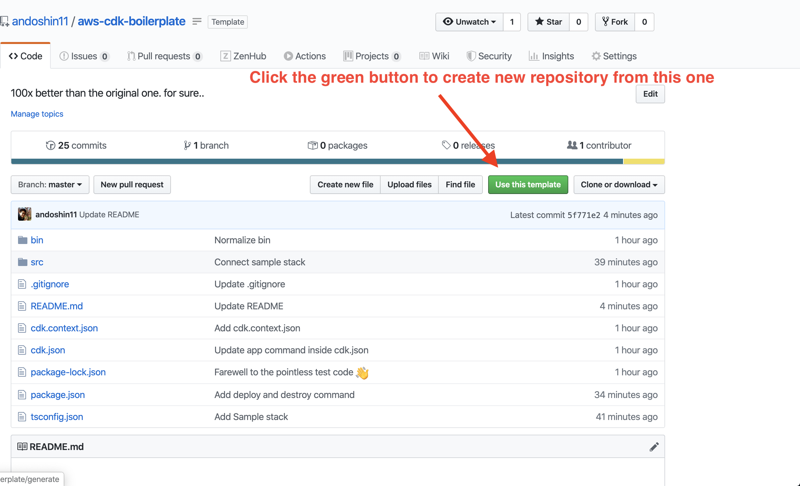

# About repository
What original `$ cdk init --language=typescript` command provides you is.... nothing more than tragedy. :disappointed:

As a professional TypeScript developer, I felt obligated to do something good to this world, so I made this repository!

## How to use
Click the green button to create a new repository from this one!



## Quick look repository structure

```
.
├── README.md
├── bin
│   └── cdk-boilerplate.js
├── cdk.context.json
├── cdk.json
├── package-lock.json
├── package.json
├── src
│   ├── bin
│   │   └── cdk-boilerplate.ts
│   ├── const
│   │   ├── index.ts
│   │   └── stacks.ts
│   └── stacks
│       ├── base.ts
│       ├── index.ts
│       └── sample.ts
└── tsconfig.json

5 directories, 13 files
```

## What's diferrent from the original one?

### Using `src` directory as a centrized code management directory
Because why not?

### Specifying `outDir` option inside `tsconfig.json`
You should **never** git-ignore `*.js` or `*.d.ts` as a whole!

I'd prefer a much elegant solution, which is isolating output directory and simply ignore that one alone. Simple!

I also removed a few unnecessary options from `tsconfig.json` so please check them out as well.

### Better `bin` management
When your code entrypoint has (relatively) complex application logic, you should keep them inside `src` and keep anything outside `src` dir as dead-simple as possible.

### Removing `ts-node`
Why you need `ts-node` when your npm script already has a `build` command?

No offence to the `ts-node` maintainers, however IMO I believe no production grade code-base should use `ts-node` as a runtime, unless you are 100% sure what `ts-node` is doing under the hood.

### Droping test
This may be the most controversial one.
However, it all comes down to this simple question.

> Should I ever need to snapshot-test IaC code-base?

The choice is yours.

(Just keep in mind that original test code is totally pointless, so setup your own test structure from the scratch even if you are the one with the necessity!)

